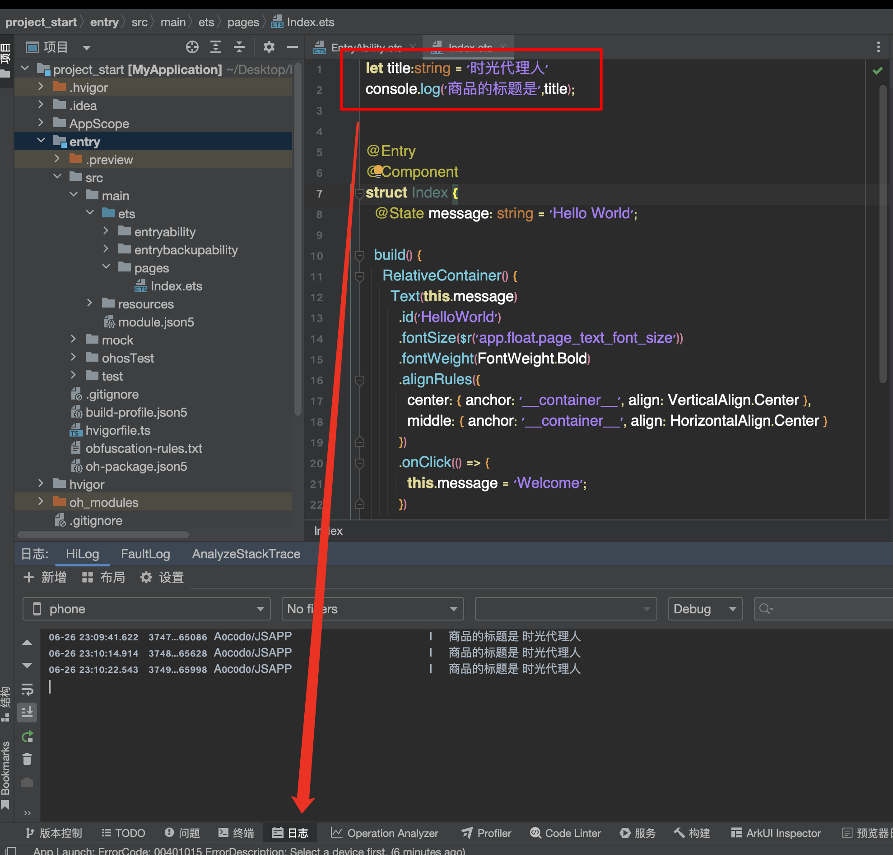
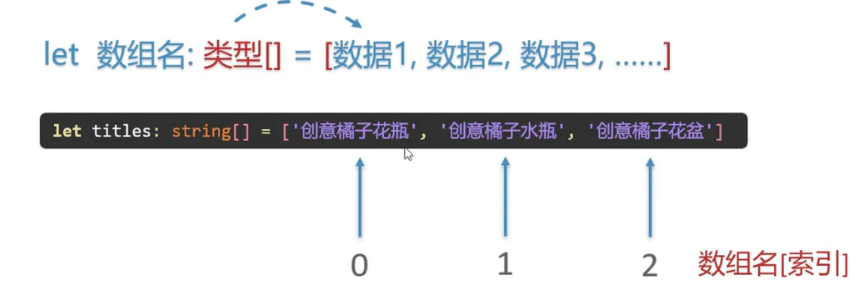

# 学习过程中的小技巧
1. 可以通过`console.log(string::message,args)`可以在DecEco中通知栏中的日志可以显示输出的结果。

2. 注视是`//`
# 数据类型
1. 基本数据类型：
   * 文字信息 -> 字符串类型 (**string**)
   * 数字信息 -> 数字类型 (**number**)
   * 状态信息 -> 布尔类型 (**boolean**)
     * true
     * false
2. 如何命名变量：
```typescript
   let 变量名:数据类型 = 值
```
# 数组
1. 一次性保存多个同类型的数据
```typescript
    let 数组名:类型[] = [数据1,数据2,数据3,...]
```

```typescript
let titles:string[] = ['创意橘子花瓶','创意橘子水瓶','创意橘子水泡'];
console.log('数组是',titles);
console.log('产品1是',titles[0]);
```
2. 数组中数据的索引是从**0**开始。
# 对象
1. 一次性存储多个不同类型的数据
```typescript
    let vase:数据类型 //对象名
    {
        tilte: '创意橘子花瓶',
        price: 12.99
    }
```
```typescript
    interface Goods{ //接口名
        title: string,
        price: number
    }
```
2. 引用对象里面的变量使用`vase.title`这种运算符方式得到对象内部的变量。
3. 属性名: 属性值 -> 键值对 -> 键值对之间用逗号隔开。
   
# 函数
1. 使用函数封装代码，提升代码复用性
```typescript
    function calc(r: number)
    {
        return 2 * 3.14 * r;
    }
```
2. 函数可以没有返回值也没有参数，有点像cpp中的`void PrintLog()`函数。

# 箭头函数
1. 使用箭头函数封装代码，提升代码复用性
```typescript
    let sum = (num1:number, num2:number) => {
        return num1 + num2;
    } 
    sum(1,2);
```
```typescript
    () => {}//这是最基本的用法
```


