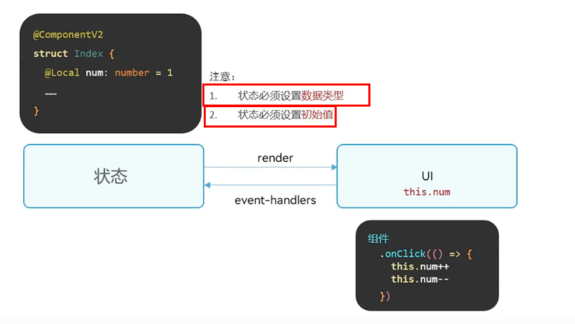

# ArkTS交互核心
## IF条件语句
```typescript
if (逻辑条件){
    条件成立执行的代码
} 
else if (条件2){
    条件2成立的执行
}
...

else {
    以上条件都不成立执行的代码
}
```
## 条件表达式
1. 使用用途：


**推荐被选中变成红色，没有被选中的变成绿色**

2. 具体用法：

```typescript
条件 ? 条件成立的表达式 : 条件不成立的表达式
```
3. 条件表达式的优先级高于 `=`符号。
## 条件渲染
1. 根据逻辑条件结果，渲染不同的UI内容

```typescript
if（条件1）｛
    组件1
｝ 
else if（条件2）
{ 
    组件2
} 
else {
    组件 
}
```
## 循环渲染
1. 根据数组数据重复渲染UI内容
```typescript
ForEach(数组, (item: 类型, index: number) => {
    组件
})
```
## 状态管理（V2）
1. 应用的运行时的状态是参数，当参数改变时，UI渲染刷新

2. 状态变量：使用 **装饰器**装饰，状态变量数据改变会引起 **UI的渲染刷新**。

   * 要定义和使用V2状态:
    ```typescript
    @ComponentV2
    ```
   * 在内部使用 **装饰器** 修饰变量，即可以用`this`在组件内部使用该变量 

    *如果使用外部定义的普通变量，变量值不能被修改*
## @Builder装饰函数
1. 使用@Builder装饰函数，**封装的UI元素，提升复用性**
2. **@Build装饰的函数也称为“自定义构建函数”**

