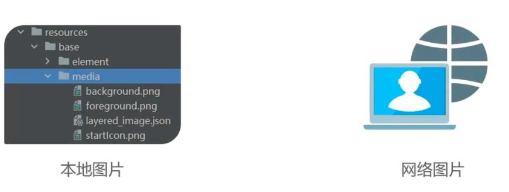
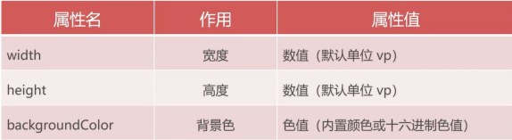
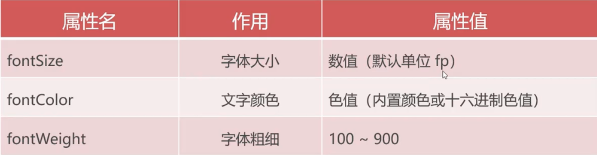
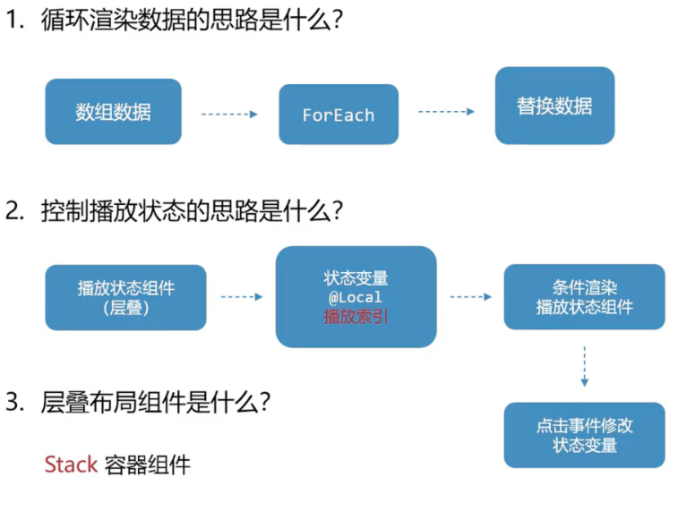

# ArkUI基本介绍
1. ArkUI(方舟开发框架)：构建鸿蒙应用界面的框架
2. 组件：界面构建与显示的最小单位
3. 鸿蒙界面布局的思路是：**先布局，再内容**
## 组件的分类
1. 容器组件：布局
```typescript
    //组件名() {}
    Column() {}
    Row() {}
```
1. 内容组件：内容
```typescript
    Text('内容')
```
**实际上就是布局组件有{ }来存放在该布局组件里的内容，而内容组件没有{ }.**

**先设计布局组件，再在布局组件内容添加内容组件。**
## 常见组件
### 容器组件
1. `Column(){}`：文本可以竖着排列
2. `Row(){}`：文本可以横着排列
3. `bulid(){}`:只允许有 **唯一的一个容器根组件。**
4. `stack(){}`:层叠布局组件
#### 相关属性
1. `layoutWeight(数字)`:将外层组件剩余尺寸分成指定份数，当前组件占用对应的份数。
2. 扩充组件安全区代码：`.expandSafeArea([SafeAreaType.SYSTEM], [SafeAreaEdge.TOP,SafeAreaEdge.BOTTOM])`
### 内容组件
1. `Text('内容');`：内部存放内容
2. `Image(图像资源路径)`:为界面添加图像资源
```typescript
    Image(图像资源路径)
```


 * 本地图片的写法:`Image($r('app,media.xx))`
   * 图片的路径不能存在中文路径
 * 网络图片:`http:xxx`
```typescript
Image($r('app.media.quanyu')).width(200);
Image('https://alliance-communityfile-drcn.dbankcdn.com/FileServer/getFile/cmtyPub/103/404/958/0260086000103404958.20250124163733.25530158864004726108414386177658:50001231000000:2800:1CC1DC504F89B788C73C5763F9A64A8127B26836ED465B79C22D17B09988AA18.jpg').width(200);
```
3. 在`ArkTS`语言中， **对于svg**图片可以用代码修改颜色。
```typescript
Image($r('app.media.image'))
  .width(24)
  .fillColor('#f6f6f6')
```
4. 可滚动的组件是:
```typescript
List(){
    ListItem(){具体内容}
}
    .scrollBar(BarState.Off)//删除移动端的滚动条
```
## 通用属性---所有属性都能使用
```typescript
组件
    .属性(值)
```

1. 对于`phone`版，满屏尺寸是 360`vp`,或者写`.width('100%)`

## 文本属性---使用文本属性美化文字外观样式


1. 图片太大可以使用 **通用属性**来调整--->调整一个`.width()`就可以等比例缩放图片大小。
## 内外边距属性--调整组件及内容的位置
1. 四个方向间距相同：
```typescript
组件
    .padding(数值)
    .margin(数值)
```
1. 四个方向间距不同
```typescript
组件
    .padding({top: 10, bottom: 20, left: 30, right: 40})
    .margin({top: 10, bottom: 20, left: 30, right: 40})
```
## 边框属性--为组件添加边框效果
```typescript
组件
    .border({
        width: 粗细,
        color: 颜色,//使用Color枚举类型进行选择变换
        style: 线条样式,//BorderStyle枚举类型进行变换
        radius: 圆角度数,
    })
```
## 控制文本水平居中属性
```typescript
组件
    .textAlign(TextAlign.Center)
```
```typescript
    .border({
      width: 5,
      color: Color.Black,
      style: BorderStyle.Dotted,
      radius: 30
    })
```
## LayoutWeight(数字)作用是
将外层组件剩余尺寸分成指定份数，当前组件占用对应的份数
主要用于 **容器组件**中。
## 点击属性
1. 点击该组件可以执行内部的箭头函数来修改相应的状态变量

```typescript
.onClick(() => {
    this.num++
})
```

# 案例学习
## 歌曲列表
1. 先整体，再局部
2. 先布局，再内容，后美化
## 歌单交互



