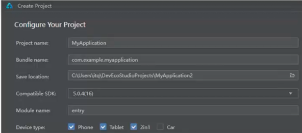

# 如何创建项目

* `Bundle name`:包名称--->域名+项目名
* `Compatible SDK`:API版本
* `Module name`:项目默认入口模块
* `Device type`:项目支持的设备类型
    1. Phone:部署到手机端
    2. Tablet:部署到平板端
    3. 2in1:就是华为出现的双折叠手机这种终端设备:俗称**2合1设备**
    4. Car:车载设备
    5. Wearable:穿戴设备
    6. TV:电视端
# 配置软件：个性化定制软件主题和插件
1. 在DecEco继承开发环境中找到`Preferences`模块，选择**软件主题**和**代码区，插件**
    * **插件**：存在`Marketplace`和`已安装`的模块，可以下载对应的**插件**
        
    

# 基础入门
## 了解基于HarmonyOS的工程结构
```plaintext
entry/ #默认的入口模块
|---src/
|   |--- main/
|   |   |---ets/

```
1. `代码文件:entry/src/main/ets/pages`存放代码相关的文件夹
2. `资源文件:entry/src/main/resources`:图片文件或者通用的配置文件。
3. 目前**阶段软件界面**的`.ets`文件都放到`pages`里面
4. HarmonyOS主开发语言是 **ArkTS**它是基于**TypeScript**进行扩充和提升。
## 了解默认代码含义
1. `@`开头的：用来约定后面代码所需要的功能
   1. `@Entry`：表示程序的入口
   2. `@Component`：用来约定后面的代码是组件--->**在鸿蒙领域中你能够看到的都是组件**
   3. `@State`:用来说明后面的代码是一个状态或者称为一个数据--->**可以做到数据改变视图自动改变**
2. `build(){内容}组件`:代表的是构建，我们在视图中看到的图片等多媒体素材都放到build里面
3. `RelativeContainer(){}和Text()`:系统组件--->**HarmonyOS提供的都是系统组件**
4. Text()后面带.的都是描述组件外观或者组件功能的代码。
```TypeScript
build() {
    RelativeContainer() {
      Text(this.message)
        .id('HelloWorld')
        .fontSize($r('app.float.page_text_font_size'))
        .fontWeight(FontWeight.Bold)
        .alignRules({
          center: { anchor: '__container__', align: VerticalAlign.Center },
          middle: { anchor: '__container__', align: HorizontalAlign.Center }
        })
        .onClick(() => {
          this.message = 'Welcome';
        })
    }
    .height('100%')
    .width('100%')
  }
   ```

